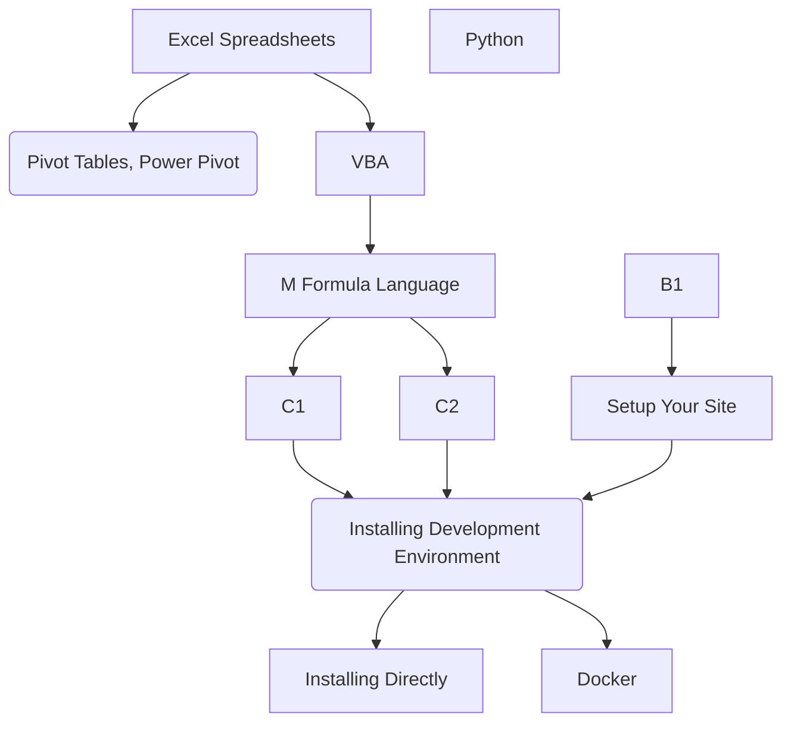

I thought I should start with my journey and why I started to document my learning and progress in my professional field. Starting in the industry as an undergrate I definately felt like I was taught the skills to continue my professional development beyond the classroom. Learning from senior colleuges and the projects I got to be part of really enhanced my knowledge but also gave me ideas where processes and tools that could be improved. I was always thinking there's got to be a better way of doing this, and a matter of fact there always is!

## Where I started

I first started in a company which used Excel spreadsheets for absolutely everything. No macros or VBA code (Visual Basics for Applications) just very long formulas with IF, VLOOKUP and HLOOKUP functions which was very clunky but hey it worked for what they needed. I spent some time learning how to develop a dashboard for reporting as they didnt have anything and the person that made their spreadsheets was no longer working there. I hindsight the dashboard I ended up creating with pivot tables makes me cringe but I'm now equipped with better tools. But with pivot tables being so user friendly my boss was very happy! Unfortunately at job this is as far as broadened my toolkit as I didn't have much spare time to learn more still being in University.

After completing my degree at University I still kept all my hard copy notes which are now sitting in a storage tub, it's too heavy to move now. But in my last year I changed to typing my notes into OneNote to try and reduce the amount of paper and pens I was going through and ended up continuing this into my work. Eveything I learn I type into OneNote so I can come back later and remember what I did as I always forget things. Like any other person we naturally lose certain information replacing it with what is more important, and in this role everyday and project I came across was somewhat different. Again I saw more opportunity to improve things and in my spare time I would research and see if my ideas were possible.

I started writing VBA code for spreadsheets and writing scripts for programs as many that I was working with had an application programming interface (API). This is really where my trusty OneNote came in handy! As I learnt something new I typed it in and any websites I came accross I copied the links. This really saved time when I needed to come back to something and couldn't remember how I did something or didn't want to spend excess time finding the resources online again it was quick and easy to find it. I'm also on the lookout for software that does OneNote even better for the application I use it for but the best thing about OneNote is that if you have Microsoft Office then you have OneNote so its very accessible and easy.

### Progress

My learning progress can be simplified down to a flowchart all starting really with Excel. I think its one of the most powerful, dynamic and familiar with the majority especially engineers. But some don't know about pivot tables, power query, and power pivot but we all have the ability to learn about them and impliment it!

I definately like to call myself a jack of all trades and thus a master of none when it comes to using software and code as I love to ingest knowledge. 

### My Projects

My current project at the moment is [My Site Project](https://github.com/drkOluhv/drkOluhv.github.io)
